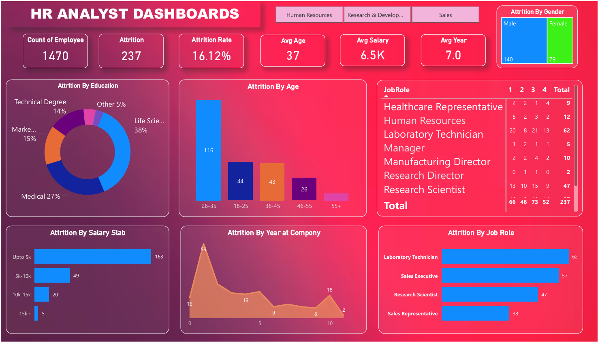

# HR-Analytics-Dashboard-PowerBI

## Project Overview
This project provides insights into employee attrition, workforce demographics, job satisfaction, and performance metrics using Power BI.

## Tools Used
- Power BI
- Excel
- Data Cleaning
- Data Visualization

## Key KPIs
- Total Employees
- Attrition Rate
- Active Employees
- Average Age
- Job Satisfaction Analysis

## Dashboard Features
- Attrition Analysis
- Department-wise Analysis
- Gender Distribution
- Employee Performance Tracking
- Interactive Filters and Slicers

## Skills Demonstrated
- Data Analysis
- Data Visualization
- DAX
- Dashboard Design
- Business Intelligence

## Project Screenshot

